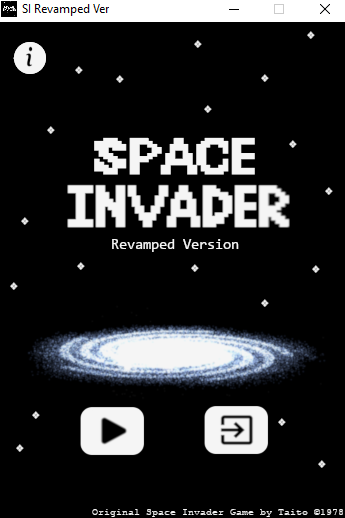
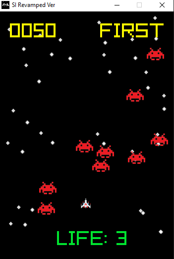
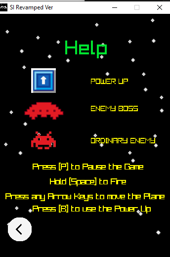

  

## Space Invader Revamped Version
### Brief Description
This is just revamped version of orginal space invader (original Space Invader copyright by Taito). Open Source Licensed, not for Commercial purpose. Feel free to enjoy or make changes.
### Installation Guide
1. Download all files in this repository. (Make sure it has the same location format like in this repository)
2. Run `Space_Invader_Revamped_Ver.exe` to play the game.
### Editors Guide
1. Download all files in this repository. (Make sure it has the same location format like in this repository)
2. Download `Raylib` from www.raylib.com .
3. Run `Notepad ++ for Raylib`.
4. Open `SC.c`.
5. Edit as you like. Enjoy !!!
### Note : further information about `Raylib` visit www.raylib.com.
### Documentation
     
